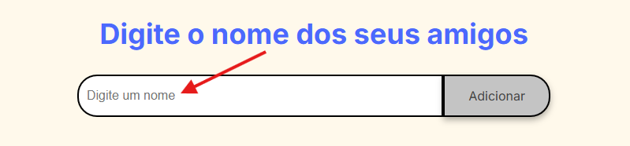
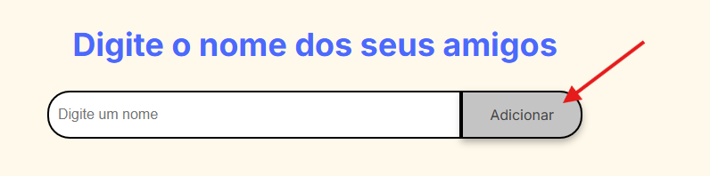
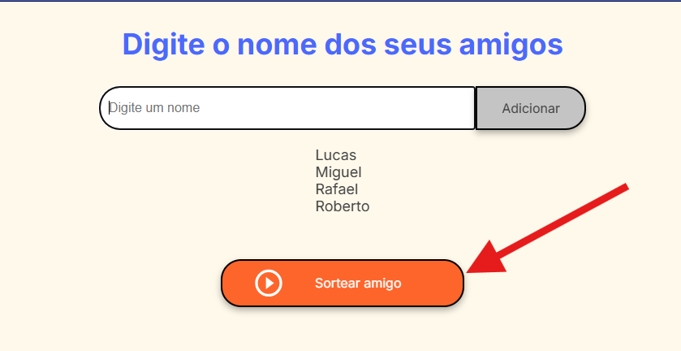
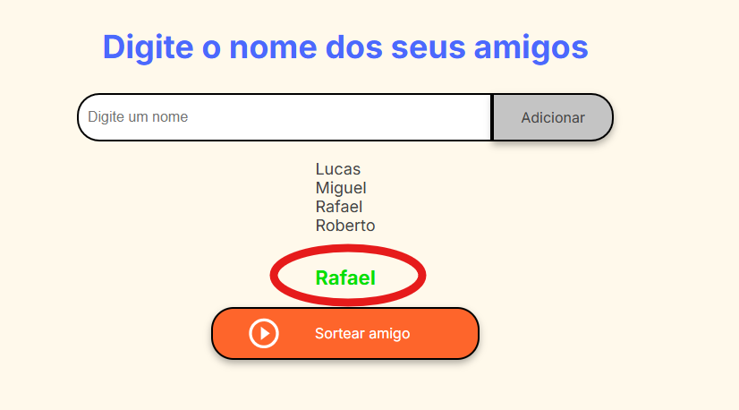

# 🎉 Challenge Amigo Secreto 🎁

Desafio do amigo secreto do programa **Alura-ONE**!

## 🤔 Como funciona?

1️⃣ **Digite um nome** no campo **"Digite um nome"** para adicionar um participante à brincadeira! 📝✨

   

2️⃣ **Clique no botão "Adicionar"** ➕ para inserir o nome na lista de amigos. Cada amigo adicionado deixará a brincadeira ainda mais divertida! 🥳🎈

   

3️⃣ Depois que todos os nomes forem adicionados, **clique no botão "Sortear amigo"** 🔄🎯 para fazer o sorteio aleatório entre os participantes. Quem será seu amigo secreto? 👀🎁

   

## Agora é só se divertir com o desafio! 🎉
  
